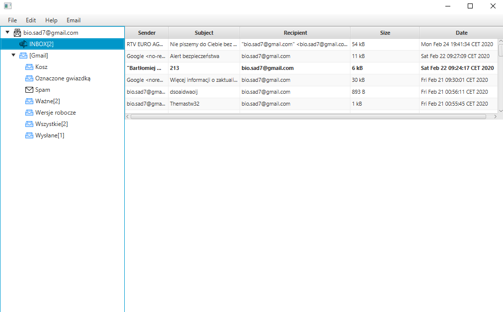

# EmailClient
> The Fully functional Email Client!

## Table of contents
* [General info](#general-info)
* [Screenshots](#screenshots)
* [Technologies](#technologies)
* [Features](#features)
* [Status](#status)
* [Inspiration](#inspiration)
* [Contact](#contact)

## General info
The purpose of it is to show how I managed to do a complete Project.

## Screenshot

## Technologies
* Java 11 - version 11.0.1
* JavaFX - version 11.0.2
* JavaX.Mail - version 1.6.2
* JavaBeans Activation Framework
* Multithreading
* Serializable
* Css

## Features
* Ability to receive, write Emails
* Ability to add multiple Accounts
* Ability to change Theme Style
* Ability to receive new Emails while program in on.

## Status
Project is: _finished_

## Inspiration
Based on the Advanced Java programming with JavaFx: Write an email client.

## Contact
Created by MrJinno. Email: wojtczakbartek7@gmail.com
